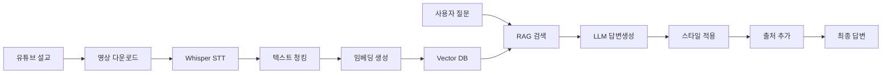

# 🌱 씨앗AI - AI 설교 Q&A 서비스

[](https://github.com/urim-thummim/seeat-ai)
[](https://github.com/urim-thummim/seeat-ai)

> "목사님의 설교가 살아있는 상담사가 되어, 성도들의 신앙 여정을 24시간 동행한다"

## 📖 프로젝트 소개

씨앗교회 AI 설교 QA 서비스는 RAG(Retrieval-Augmented Generation) 기술을 활용하여 목사님의 설교를 기반으로 성도들의 신앙적 질문에 개인화된 답변을 제공하는 AI 서비스입니다.

### 🎯 핵심 가치

- **🕐 24시간 접근 가능**: 언제든지 신앙적 고민을 질문하고 즉시 답변 받기
- **👨‍💼 개인화된 답변**: 목사님의 고유한 설교 스타일과 신학적 관점 반영
- **📍 정확한 출처**: 답변과 함께 원본 유튜브 링크(타임스탬프) 제공
- **🔍 맥락적 이해**: 전체 설교 맥락에서 적절한 성경적 근거와 실천적 조언

## 🏗️ 시스템 아키텍처



## 🛠️ 기술 스택

### Backend (Python)
- **Framework**: FastAPI
- **LLM**: OpenAI GPT-4o, Whisper
- **RAG**: LangChain
- **Vector DB**: ChromaDB → Pinecone
- **Embedding**: sentence-transformers

### Frontend (TypeScript)
- **Framework**: Next.js 14
- **UI**: Tailwind CSS + shadcn/ui
- **State**: Zustand + TanStack Query

### Infrastructure
- **Containerization**: Docker
- **Cloud**: AWS/GCP
- **Monitoring**: Prometheus + Grafana
- **CI/CD**: GitHub Actions

## 🚀 빠른 시작

### 사전 요구사항
- Python 3.11+
- Node.js 18+
- Docker & Docker Compose
- OpenAI API Key

### 로컬 개발 환경 설정

1. **저장소 클론**
```bash
git clone https://github.com/urim-thummim/seeat-ai
cd seeat-ai
```

2. **환경 변수 설정**
```bash
cp .env.example .env
# .env 파일에 API 키 등 설정
```

3. **백엔드 설정**
```bash
cd backend
python -m venv venv
source venv/bin/activate  # Windows: venv\Scripts\activate
pip install -r requirements.txt
```

4. **개발 서버 실행**
```bash
# 백엔드 (FastAPI)
cd backend
uvicorn app.main:app --reload --port 8000

# 프론트엔드 (Next.js)
cd frontend
npm install
npm run dev
```

5. **Docker Compose로 전체 환경 실행**
```bash
docker-compose up -d
```

## 📁 프로젝트 구조

```
seeat_ai/
├── 📁 docs/                    # 📋 프로젝트 문서
│   ├── 01-project-overview.md
│   ├── 04-tech-stack.md
│   ├── 06-rag-pipeline.md
│   ├── 08-development-plan.md
│   └── 12-cost-analysis.md
├── 📁 backend/                 # 🐍 Python API 서버
│   ├── 📁 app/
│   │   ├── 📁 services/       # 비즈니스 로직
│   │   ├── 📁 models/         # 데이터 모델
│   │   ├── 📁 api/           # API 엔드포인트
│   │   └── 📁 core/          # 설정 및 유틸
│   ├── requirements.txt
│   └── Dockerfile
├── 📁 frontend/                # ⚛️ React 앱 (향후 구현)
├── 📁 data/                   # 📊 데이터 저장소
│   ├── 📁 raw_videos/        # 다운로드한 영상
│   ├── 📁 transcripts/       # STT 결과
│   └── 📁 embeddings/        # 벡터 데이터
├── docker-compose.yml          # 🐳 로컬 개발 환경
├── .env.example               # 🔧 환경 변수 템플릿
└── README.md                  # 📖 프로젝트 소개
```

## 🔧 주요 기능

### 1. 영상 처리 파이프라인
- **yt-dlp**: 유튜브 영상 자동 다운로드
- **Whisper**: 고품질 한국어 STT
- **지능형 청킹**: 설교 구조를 고려한 텍스트 분할
- **타임스탬프 매핑**: 정확한 시간 정보 추출

### 2. RAG 검색 시스템
- **하이브리드 검색**: 의미 검색 + 키워드 검색
- **메타데이터 필터링**: 날짜, 주제, 성경 구절별 검색
- **컨텍스트 최적화**: 관련도 높은 구간만 선별

### 3. 개인화 답변 생성
- **목사님 스타일 학습**: Few-shot learning으로 말투 반영
- **출처 제공**: 유튜브 타임스탬프 링크 자동 생성
- **품질 관리**: RAGAs 기반 자동 평가

## 📊 성능 지표

### 목표 성능
- **STT 정확도**: 95% 이상
- **검색 정확도**: 80% 이상  
- **응답 시간**: 평균 3초 이내
- **사용자 만족도**: 4.5/5 이상

### 비용 효율성
- **개발 단계**: 월 $80-180
- **프로덕션 초기**: 월 $420-850
- **목표 단가**: 사용자당 월 $2 이하

## 🗓️ 개발 로드맵

### ✅ Phase 1: 기반 구축 (3주)
- [x] 프로젝트 설정 및 문서화
- [ ] 유튜브 다운로드 시스템
- [ ] Whisper STT 파이프라인
- [ ] 텍스트 청킹 시스템

### 🔄 Phase 2: RAG 엔진 (2주)
- [ ] 벡터 데이터베이스 구축
- [ ] 하이브리드 검색 시스템
- [ ] LangChain RAG 체인

### 🎯 Phase 3: 답변 생성 (2주)
- [ ] GPT-4o 통합
- [ ] 목사님 스타일 개인화
- [ ] RAGAs 평가 시스템

### 🎨 Phase 4: 프론트엔드 (2주)
- [ ] Next.js 채팅 인터페이스
- [ ] 관리자 대시보드
- [ ] 배포 및 최적화

## 🤝 기여하기

1. Fork the repository
2. Create a feature branch (`git checkout -b feature/amazing-feature`)
3. Commit your changes (`git commit -m 'Add amazing feature'`)
4. Push to the branch (`git push origin feature/amazing-feature`)
5. Open a Pull Request

### 코딩 스타일
```bash
# 코드 포매팅
black backend/
isort backend/

# 린팅
flake8 backend/
mypy backend/

# 테스트
pytest backend/tests/
```

## 📋 API 문서

### 주요 엔드포인트

```http
POST /api/v1/sermons/upload
Content-Type: application/json

{
  "youtube_url": "https://youtube.com/watch?v=xxx",
  "title": "설교 제목",
  "date": "2024-12-28"
}
```

```http
POST /api/v1/questions/ask
Content-Type: application/json

{
  "question": "용서하기 어려울 때 어떻게 해야 하나요?",
  "user_id": "user123"
}
```

자세한 API 문서는 서버 실행 후 `http://localhost:8000/docs`에서 확인할 수 있습니다.

## 📝 라이센스

This project is licensed under the MIT License - see the [LICENSE](LICENSE) file for details.

## 👥 팀

- **개발팀**: AI/Backend 개발
- **씨앗교회**: 도메인 전문성 및 피드백
- **커뮤니티**: 오픈소스 기여자들

## 📞 문의

- **이슈 제보**: [GitHub Issues](https://github.com/urim-thummim/seeat-ai/issues)
- **기능 제안**: [GitHub Discussions](https://github.com/urim-thummim/seeat-ai/discussions)
- **이메일**: woorjb133@gmail.com

## 🙏 감사의 말

- **OpenAI**: Whisper, GPT-4o API 제공
- **LangChain**: RAG 프레임워크
- **Hugging Face**: 한국어 모델 및 도구
- **씨앗교회**: 프로젝트 후원 및 도메인 전문성

---

**🌱 내가 진실로 진실로 너희에게 이르노니
한 알의 씨앗이 땅에 떨어져 죽지 아니하면
한 알 그대로 있고
죽으면 많은 열매를 맺느니라** **- 요한복음 12:24**

---

<div align="center">

[](https://github.com/urim-thummim/seeat-ai)
[](https://github.com/urim-thummim/seeat-ai)
[](LICENSE)
[](https://python.org)
[](https://fastapi.tiangolo.com)

</div> 