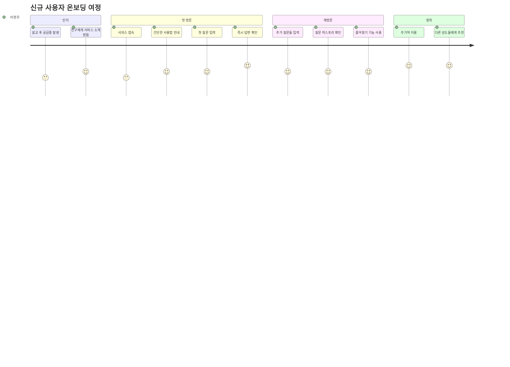
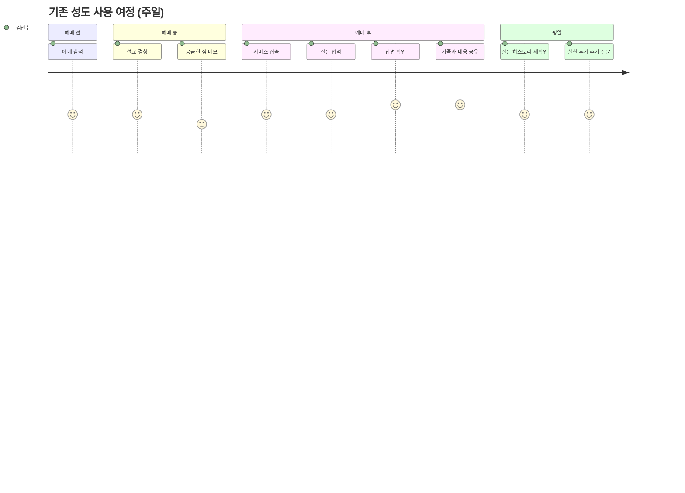

# 사용자 스토리 및 시나리오

## 👥 사용자 페르소나

### 👤 1차 사용자: 성도들

#### 페르소나 A: 김민수 (35세, 직장인)
- **배경**: 씨앗교회 5년차 성도, IT회사 과장, 두 아이의 아버지
- **특징**: 바쁜 일상으로 목사님께 직접 질문하기 어려움
- **니즈**: 직장 생활과 신앙 생활의 균형, 자녀 양육에 대한 성경적 조언
- **기술 수준**: 높음 (스마트폰, 웹 서비스 능숙하게 사용)

#### 페르소나 B: 박영희 (62세, 전업주부)
- **배경**: 씨앗교회 10년차 성도, 최근 남편 은퇴 후 관계 고민
- **특징**: 설교를 듣고 나서 궁금한 점이 많지만 질문하기 부끄러워함
- **니즈**: 부부 관계, 건강 염려, 자녀들과의 소통 문제
- **기술 수준**: 중간 (기본적인 스마트폰 사용 가능)

#### 페르소나 C: 이현우 (23세, 대학생)
- **배경**: 씨앗교회 새가족 1년차, 최근 신앙에 관심을 가지기 시작
- **특징**: 신앙에 대한 근본적인 질문들이 많음, 또래 신앙인 친구가 적음
- **니즈**: 기초적인 신앙 질문, 진로 고민, 연애와 신앙의 관계
- **기술 수준**: 매우 높음 (디지털 네이티브)

### 👨‍💼 2차 사용자: 목사님/교역자

#### 페르소나 D: 김철수 목사님 (45세)
- **배경**: 씨앗교회 담임목사 7년차, 신학대학원 졸업
- **특징**: 성도들과의 소통을 중요하게 여기지만 시간적 제약 많음
- **니즈**: 성도들의 실제 고민 파악, 설교 효과 측정, 목회 효율성 향상
- **기술 수준**: 중간 (기본적인 컴퓨터 사용)

## 📖 사용자 스토리

### 🔍 Epic 1: 설교 기반 질문 답변

#### Story 1.1: 설교 후 즉시 질문
**As a** 성도 (김민수)  
**I want to** 설교를 들은 직후 궁금한 점을 바로 질문하고 답변받기  
**So that** 설교 내용을 더 깊이 이해하고 실생활에 적용할 수 있다

**Acceptance Criteria:**
- [ ] 설교 제목이나 날짜를 기반으로 해당 설교 내용에서 답변을 찾을 수 있다
- [ ] 질문 후 3초 이내에 답변을 받을 수 있다
- [ ] 답변과 함께 설교 원본 영상의 해당 부분 링크를 제공받는다
- [ ] 각 목사님의 말투와 스타일로 답변을 받는다

#### Story 1.2: 과거 설교 검색
**As a** 성도 (박영희)  
**I want to** 예전에 들었던 설교 중 특정 주제에 대한 내용을 다시 찾아보기  
**So that** 현재 고민과 관련된 목사님의 말씀을 다시 들을 수 있다

**Acceptance Criteria:**
- [ ] 주제, 성경 구절, 키워드로 과거 설교를 검색할 수 있다
- [ ] 검색 결과에서 관련도가 높은 설교 구간을 우선 표시한다
- [ ] 각 결과마다 설교 날짜와 유튜브 링크를 제공한다

#### Story 1.3: 신앙 기초 질문
**As a** 새가족 성도 (이현우)  
**I want to** 기본적인 신앙 질문을 부끄러워하지 않고 자유롭게 하기  
**So that** 신앙의 기초를 튼튼히 세울 수 있다

**Acceptance Criteria:**
- [ ] 신앙 기초와 관련된 질문 템플릿을 제공한다
- [ ] 성경적 근거와 함께 쉽게 이해할 수 있는 답변을 제공한다
- [ ] 추가 학습 자료(성경 구절, 관련 설교)를 추천한다

### 📱 Epic 2: 사용자 경험

#### Story 2.1: 간편한 질문 입력
**As a** 성도 (박영희)  
**I want to** 복잡한 조작 없이 간단하게 질문을 입력하기  
**So that** 기술적 어려움 없이 서비스를 이용할 수 있다

**Acceptance Criteria:**
- [ ] 모바일에서 쉽게 접근할 수 있다
- [ ] 음성 입력 기능을 제공한다
- [ ] 자주 묻는 질문 템플릿을 제공한다
- [ ] 큰 글씨와 간단한 인터페이스를 제공한다

#### Story 2.2: 질문 히스토리 관리
**As a** 성도 (김민수)  
**I want to** 내가 했던 질문과 답변을 나중에 다시 볼 수 있기  
**So that** 영적 성장의 과정을 되돌아보고 지속적으로 학습할 수 있다

**Acceptance Criteria:**
- [ ] 개인별 질문 히스토리를 저장한다
- [ ] 날짜별, 주제별로 질문을 분류해서 볼 수 있다
- [ ] 즐겨찾기 기능으로 중요한 답변을 저장할 수 있다

### 🔧 Epic 3: 관리자 기능

#### Story 3.1: 설교 업로드 및 관리
**As a** 목사님 (김철수)  
**I want to** 새로운 설교 영상을 쉽게 업로드하고 관리하기  
**So that** 성도들이 최신 설교를 기반으로 질문할 수 있도록 한다

**Acceptance Criteria:**
- [ ] 유튜브 링크만으로 자동 업로드가 가능하다
- [ ] 설교 제목, 날짜, 주제를 쉽게 편집할 수 있다
- [ ] 처리 상태(다운로드 중, STT 진행 중, 완료)를 확인할 수 있다
- [ ] 설교별 질문 통계를 확인할 수 있다

#### Story 3.2: 답변 품질 모니터링
**As a** 목사님 (김철수)  
**I want to** AI가 생성한 답변의 품질을 확인하고 필요시 수정하기  
**So that** 성도들에게 정확하고 적절한 답변이 제공되도록 할 수 있다

**Acceptance Criteria:**
- [ ] 일일/주간 답변 현황을 대시보드에서 확인할 수 있다
- [ ] 부적절한 답변에 대한 알림을 받을 수 있다
- [ ] 답변에 대한 성도들의 피드백을 확인할 수 있다
- [ ] 필요시 답변을 수동으로 수정할 수 있다

## 🎭 사용자 시나리오

### 시나리오 A: 주일 설교 후 즉시 질문 (김민수)

```
1. 상황: 주일 오전 예배를 마치고 집으로 가는 차 안
2. 동기: 오늘 설교에서 "용서"에 대해 말씀하셨는데, 직장 상사와의 갈등 상황에 어떻게 적용할지 궁금함
3. 행동:
   - 스마트폰으로 서비스 접속
   - "직장에서 불공정한 대우를 하는 상사를 어떻게 용서해야 하나요?" 질문 입력
   - 3초 후 답변 확인
4. 결과:
   - 목사님 스타일의 따뜻한 답변 수신
   - 오늘 설교 중 "용서는 감정이 아닌 의지의 결단" 부분 참조
   - 해당 설교 구간 유튜브 링크 (32분 15초) 제공
5. 만족도: 매우 높음 - 즉시 구체적인 답변을 받아 실천 방향을 찾음
```

### 시나리오 B: 과거 설교 검색 (박영희)

```
1. 상황: 남편과의 갈등으로 힘들어하는 저녁 시간
2. 동기: 예전에 목사님이 부부 관계에 대해 말씀하신 내용을 다시 듣고 싶음
3. 행동:
   - 서비스에 접속하여 "부부 갈등을 어떻게 해결해야 하나요?" 질문
   - 관련 설교 여러 개 결과 확인
   - 가장 관련도 높은 설교 선택하여 원본 영상 시청
4. 결과:
   - 3개월 전 "부부는 한 몸" 설교 내용 재발견
   - 해당 설교의 핵심 구간들 타임스탬프와 함께 제공
   - 실제 적용 방법에 대한 구체적 조언 획득
5. 만족도: 높음 - 위로와 실천 방향을 동시에 얻음
```

### 시나리오 C: 신앙 기초 질문 (이현우)

```
1. 상황: 대학교 기숙사에서 늦은 밤 혼자 고민하는 시간
2. 동기: 기독교에 대한 근본적인 의문이 생겼지만 누구에게 물어볼지 망설여짐
3. 행동:
   - "하나님이 정말 존재하시나요?"라는 솔직한 질문 입력
   - 부끄러움 없이 추가 질문들 연속으로 입력
4. 결과:
   - 판단하지 않는 따뜻한 톤의 답변 수신
   - 관련 성경 구절과 목사님의 과거 설교 내용 제공
   - 신앙 성장을 위한 단계별 가이드 추천
5. 만족도: 매우 높음 - 안전한 공간에서 진솔한 대화 가능
```

### 시나리오 D: 목사님의 모니터링 (김철수 목사님) - AI 생성, 현재 계획 없음.

```
1. 상황: 월요일 아침 사무실에서 주간 목회 계획 수립
2. 동기: 지난주 설교에 대한 성도들의 반응과 추가 질문 상황 파악
3. 행동:
   - 관리자 대시보드 접속
   - 지난주 질문 현황 및 주요 관심사 확인
   - AI 답변 품질 검토 및 필요시 수정
4. 결과:
   - "용서" 주제에 대한 질문이 특히 많았음을 확인
   - 몇 가지 답변의 미묘한 뉘앙스 조정
   - 다음 주 설교에서 추가 설명할 부분 메모
5. 효과: 성도들의 실제 고민을 파악하여 더 필요한 목회 방향 설정
```

## 📊 사용자 여정 맵

### 신규 사용자 (이현우) 온보딩 여정



### 기존 성도 (김민수) 일반적 사용 여정



## 🎯 성공 시나리오

### 목표 달성 시나리오

**6개월 후 씨앗교회의 변화:**

1. **성도들의 변화**
   - 월평균 300개의 질문이 올라옴
   - 설교 후 즉시 질문하는 문화 정착
   - 새가족들의 신앙 정착률 30% 향상

2. **목사님의 변화**
   - 성도들의 실제 고민과 관심사 명확히 파악
   - 설교 준비 시 성도들의 질문 패턴 반영
   - 개별 상담 요청 50% 감소하지만 질적 상담 향상

3. **교회 공동체의 변화**
   - 설교와 일상의 연결고리 강화
   - 성도들 간 신앙적 대화 주제 증가
   - 젊은 세대의 교회 참여도 향상

## 🚫 실패 시나리오 및 대응

### 잠재적 문제 상황

#### 문제 1: 낮은 사용률
**상황**: 서비스 런칭 후 3개월간 일일 질문 수 5개 미만
**원인**: 사용법 어려움, 홍보 부족, 답변 품질 문제
**대응**: 
- 사용법 교육 강화
- 교회 내 적극적 홍보
- 답변 품질 개선

#### 문제 2: 부적절한 답변
**상황**: AI가 신학적으로 부정확하거나 부적절한 답변 생성
**원인**: 훈련 데이터 부족, 프롬프트 엔지니어링 문제
**대응**:
- 목사님 검토 프로세스 강화
- 답변 생성 프롬프트 개선
- 사용자 피드백 시스템 구축

#### 문제 3: 기술적 장애
**상황**: 서버 다운, API 비용 초과, 응답 속도 저하
**원인**: 인프라 문제, 비용 관리 미흡
**대응**:
- 모니터링 시스템 강화
- 비용 알림 시스템 구축
- 백업 시스템 준비

---

**문서 버전**: v1.0  
**최종 업데이트**: 2024-12-28  
**다음 검토 예정**: 개발 진행에 따라 지속 업데이트 