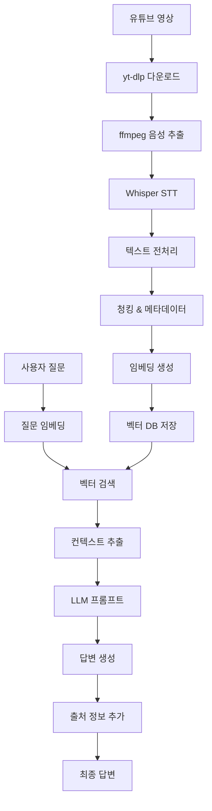

# RAG 파이프라인 상세 설계

## 🔄 전체 RAG 파이프라인 개요



## 📥 1단계: 데이터 수집 및 전처리

### 1.1 유튜브 영상 다운로드
```python
# yt-dlp 설정
ydl_opts = {
    'format': 'bestaudio/best',
    'outtmpl': 'data/raw_videos/%(title)s.%(ext)s',
    'extractaudio': True,
    'audioformat': 'mp3',
    'audioquality': '192',
    'writeinfojson': True,  # 메타데이터 저장
    'writesubtitles': False,  # 자막은 사용하지 않음 (STT 사용)
}

# 다운로드 프로세스
def download_sermon_video(youtube_url: str) -> SermonMetadata:
    """
    유튜브 영상을 다운로드하고 메타데이터를 추출
    """
    with yt_dlp.YoutubeDL(ydl_opts) as ydl:
        info = ydl.extract_info(youtube_url, download=True)
        
    return SermonMetadata(
        youtube_id=info['id'],
        title=info['title'],
        duration=info['duration'],
        upload_date=info['upload_date'],
        description=info['description'],
        thumbnail_url=info['thumbnail']
    )
```

### 1.2 음성 품질 최적화
```python
# ffmpeg 를 사용한 음성 전처리
def preprocess_audio(input_file: str, output_file: str):
    """
    음성 품질 향상을 위한 전처리
    """
    cmd = [
        'ffmpeg', '-i', input_file,
        '-af', 'highpass=f=100,lowpass=f=8000',  # 주파수 필터링
        '-af', 'volume=1.5',  # 볼륨 증폭
        '-ar', '16000',  # 샘플링 레이트 (Whisper 최적화)
        '-ac', '1',  # 모노 채널
        '-y', output_file
    ]
    subprocess.run(cmd, check=True)
```

### 1.3 STT 처리 (Whisper)
```python
# Whisper 최적화 설정
whisper_options = {
    "model": "large-v3",
    "language": "ko",
    "task": "transcribe",
    "temperature": 0.0,  # 일관성을 위해 0으로 설정
    "beam_size": 5,
    "best_of": 5,
    "condition_on_previous_text": True,
    "compression_ratio_threshold": 2.4,
    "logprob_threshold": -1.0,
    "no_speech_threshold": 0.6,
    "word_timestamps": True,  # 단어별 타임스탬프
}

def transcribe_audio(audio_file: str) -> TranscriptResult:
    """
    Whisper를 사용한 STT 처리
    """
    model = whisper.load_model("large-v3")
    result = model.transcribe(
        audio_file,
        **whisper_options
    )
    
    # 세그먼트별 처리
    segments = []
    for segment in result["segments"]:
        segments.append(TranscriptSegment(
            start_time=segment["start"],
            end_time=segment["end"],
            text=segment["text"].strip(),
            words=segment.get("words", [])
        ))
    
    return TranscriptResult(
        full_text=result["text"],
        segments=segments,
        language=result["language"]
    )
```

## 📝 2단계: 텍스트 처리 및 청킹

### 2.1 텍스트 정제 및 정규화
```python
import re
from kiwipiepy import Kiwi

def clean_and_normalize_text(text: str) -> str:
    """
    설교 텍스트 정제 및 정규화
    """
    # 반복되는 음성 인식 오류 패턴 제거
    text = re.sub(r'\b(\w+)\s+\1\b', r'\1', text)  # 중복 단어 제거
    
    # 특수 문자 정리
    text = re.sub(r'[^\w\s가-힣.,!?]', '', text)
    
    # 다중 공백 정리
    text = re.sub(r'\s+', ' ', text)
    
    # 한국어 형태소 분석기로 문장 경계 개선
    kiwi = Kiwi()
    sentences = kiwi.split_into_sents(text)
    
    return ' '.join([sent.text.strip() for sent in sentences])
```

### 2.2 지능형 청킹 전략
```python
from langchain.text_splitter import RecursiveCharacterTextSplitter

class SermonAwareTextSplitter:
    """
    설교 특성을 고려한 텍스트 분할기
    """
    
    def __init__(self):
        self.base_splitter = RecursiveCharacterTextSplitter(
            chunk_size=800,  # 토큰 수 고려 (약 600 토큰)
            chunk_overlap=100,  # 문맥 연결을 위한 오버랩
            separators=[
                "\n\n",  # 문단 구분
                "아멘.",   # 기도 구분
                "성경말씀",  # 성경 구절 구분
                ".",      # 문장 구분
                "!",
                "?",
                "\n",
                " "
            ]
        )
    
    def split_sermon_text(
        self, 
        text: str, 
        segments: List[TranscriptSegment]
    ) -> List[SermonChunk]:
        """
        설교 내용을 의미 단위로 분할
        """
        chunks = []
        current_position = 0
        
        # 기본 청킹
        base_chunks = self.base_splitter.split_text(text)
        
        for i, chunk_text in enumerate(base_chunks):
            # 해당 청크의 타임스탬프 찾기
            start_time, end_time = self._find_chunk_timestamps(
                chunk_text, text, segments, current_position
            )
            
            # 주제 분류 (간단한 키워드 기반)
            topic = self._classify_topic(chunk_text)
            
            # 성경 구절 추출
            bible_verses = self._extract_bible_verses(chunk_text)
            
            chunk = SermonChunk(
                chunk_id=f"chunk_{i:03d}",
                text=chunk_text,
                start_time=start_time,
                end_time=end_time,
                topic=topic,
                bible_verses=bible_verses,
                chunk_index=i
            )
            
            chunks.append(chunk)
            current_position += len(chunk_text)
        
        return chunks
    
    def _find_chunk_timestamps(
        self, 
        chunk_text: str, 
        full_text: str, 
        segments: List[TranscriptSegment],
        start_pos: int
    ) -> Tuple[float, float]:
        """
        청크의 시작/끝 타임스탬프 계산
        """
        chunk_start_pos = full_text.find(chunk_text, start_pos)
        chunk_end_pos = chunk_start_pos + len(chunk_text)
        
        start_time = None
        end_time = None
        
        for segment in segments:
            segment_start_pos = full_text.find(segment.text)
            segment_end_pos = segment_start_pos + len(segment.text)
            
            # 청크 시작점이 이 세그먼트에 포함되는 경우
            if (chunk_start_pos >= segment_start_pos and 
                chunk_start_pos <= segment_end_pos):
                if start_time is None:
                    start_time = segment.start_time
            
            # 청크 끝점이 이 세그먼트에 포함되는 경우
            if (chunk_end_pos >= segment_start_pos and 
                chunk_end_pos <= segment_end_pos):
                end_time = segment.end_time
        
        return start_time or 0.0, end_time or 0.0
    
    def _classify_topic(self, text: str) -> str:
        """
        청크의 주제 분류
        """
        topics = {
            "기도": ["기도", "주기도문", "간구", "아멘"],
            "찬양": ["찬양", "경배", "노래", "할렐루야"],
            "성경": ["성경", "말씀", "구절", "장", "절"],
            "간증": ["간증", "경험", "은혜", "감사"],
            "교훈": ["교훈", "가르침", "배움", "깨달음"],
            "사랑": ["사랑", "용서", "자비", "긍휼"],
            "믿음": ["믿음", "신앙", "확신", "소망"],
            "회개": ["회개", "죄", "용서", "돌이킴"]
        }
        
        for topic, keywords in topics.items():
            if any(keyword in text for keyword in keywords):
                return topic
        
        return "일반"
    
    def _extract_bible_verses(self, text: str) -> List[str]:
        """
        성경 구절 추출
        """
        # 성경 구절 패턴 매칭
        bible_pattern = r'([가-힣]+서?)\s*(\d+)장?\s*(\d+)절?'
        matches = re.findall(bible_pattern, text)
        
        verses = []
        for book, chapter, verse in matches:
            verses.append(f"{book} {chapter}:{verse}")
        
        return verses
```

## 🧠 3단계: 임베딩 생성 및 저장

### 3.1 임베딩 모델 설정
```python
from sentence_transformers import SentenceTransformer
import numpy as np

class SermonEmbeddingGenerator:
    """
    설교 텍스트용 임베딩 생성기
    """
    
    def __init__(self, model_name: str = "paraphrase-multilingual-mpnet-base-v2"):
        self.model = SentenceTransformer(model_name)
        self.dimension = self.model.get_sentence_embedding_dimension()
    
    def generate_embeddings(self, chunks: List[SermonChunk]) -> List[np.ndarray]:
        """
        청크별 임베딩 생성
        """
        # 텍스트와 메타데이터를 결합한 임베딩
        enhanced_texts = []
        
        for chunk in chunks:
            # 메타데이터를 텍스트에 포함
            enhanced_text = self._enhance_text_with_metadata(chunk)
            enhanced_texts.append(enhanced_text)
        
        # 배치 처리로 임베딩 생성
        embeddings = self.model.encode(
            enhanced_texts,
            batch_size=32,
            show_progress_bar=True,
            convert_to_numpy=True
        )
        
        return embeddings
    
    def _enhance_text_with_metadata(self, chunk: SermonChunk) -> str:
        """
        메타데이터를 텍스트에 포함하여 임베딩 품질 향상
        """
        enhanced_parts = [chunk.text]
        
        # 주제 정보 추가
        if chunk.topic != "일반":
            enhanced_parts.append(f"주제: {chunk.topic}")
        
        # 성경 구절 정보 추가
        if chunk.bible_verses:
            bible_info = ", ".join(chunk.bible_verses)
            enhanced_parts.append(f"성경구절: {bible_info}")
        
        return " ".join(enhanced_parts)
```

### 3.2 벡터 데이터베이스 저장
```python
import chromadb
from chromadb.config import Settings

class SermonVectorStore:
    """
    설교 벡터 저장소 관리
    """
    
    def __init__(self, persist_directory: str = "data/chromadb"):
        self.client = chromadb.PersistentClient(
            path=persist_directory,
            settings=Settings(
                anonymized_telemetry=False,
                allow_reset=True
            )
        )
        
    def create_sermon_collection(self, sermon_id: str) -> chromadb.Collection:
        """
        설교별 컬렉션 생성
        """
        collection_name = f"sermon_{sermon_id}"
        
        # 기존 컬렉션이 있으면 삭제
        try:
            self.client.delete_collection(collection_name)
        except:
            pass
        
        collection = self.client.create_collection(
            name=collection_name,
            metadata={"sermon_id": sermon_id}
        )
        
        return collection
    
    def add_chunks_to_collection(
        self,
        collection: chromadb.Collection,
        chunks: List[SermonChunk],
        embeddings: List[np.ndarray],
        sermon_metadata: SermonMetadata
    ):
        """
        청크와 임베딩을 컬렉션에 추가
        """
        ids = []
        metadatas = []
        documents = []
        embeddings_list = []
        
        for i, (chunk, embedding) in enumerate(zip(chunks, embeddings)):
            # 고유 ID 생성
            chunk_id = f"{sermon_metadata.youtube_id}_{chunk.chunk_id}"
            
            # 메타데이터 구성
            metadata = {
                "sermon_id": sermon_metadata.youtube_id,
                "sermon_title": sermon_metadata.title,
                "sermon_date": sermon_metadata.upload_date,
                "chunk_index": chunk.chunk_index,
                "start_time": chunk.start_time,
                "end_time": chunk.end_time,
                "topic": chunk.topic,
                "bible_verses": json.dumps(chunk.bible_verses),
                "youtube_url": f"https://youtube.com/watch?v={sermon_metadata.youtube_id}",
                "timestamp_url": f"https://youtube.com/watch?v={sermon_metadata.youtube_id}&t={int(chunk.start_time)}s"
            }
            
            ids.append(chunk_id)
            metadatas.append(metadata)
            documents.append(chunk.text)
            embeddings_list.append(embedding.tolist())
        
        # 배치 추가
        collection.add(
            ids=ids,
            metadatas=metadatas,
            documents=documents,
            embeddings=embeddings_list
        )
```

## 🔍 4단계: 검색 및 답변 생성

### 4.1 하이브리드 검색 시스템
```python
from typing import List, Dict, Any
import re

class HybridRetriever:
    """
    의미 검색 + 키워드 검색을 결합한 하이브리드 검색
    """
    
    def __init__(self, vector_store: SermonVectorStore, embedding_generator: SermonEmbeddingGenerator):
        self.vector_store = vector_store
        self.embedding_generator = embedding_generator
    
    def retrieve_relevant_chunks(
        self, 
        query: str, 
        sermon_collections: List[str],
        top_k: int = 5
    ) -> List[Dict[str, Any]]:
        """
        관련 청크 검색
        """
        # 1. 쿼리 임베딩 생성
        query_embedding = self.embedding_generator.model.encode([query])[0]
        
        # 2. 각 설교 컬렉션에서 검색
        all_results = []
        
        for collection_name in sermon_collections:
            collection = self.vector_store.client.get_collection(collection_name)
            
            # 의미 검색
            semantic_results = collection.query(
                query_embeddings=[query_embedding.tolist()],
                n_results=top_k * 2,  # 더 많이 가져와서 후처리
                include=["documents", "metadatas", "distances"]
            )
            
            # 키워드 검색 (단순 포함 관계)
            keyword_results = self._keyword_search(collection, query, top_k)
            
            # 결과 병합 및 재랭킹
            merged_results = self._merge_and_rerank(
                semantic_results, keyword_results, query
            )
            
            all_results.extend(merged_results)
        
        # 전체 결과에서 상위 K개 선택
        final_results = sorted(all_results, key=lambda x: x['score'], reverse=True)[:top_k]
        
        return final_results
    
    def _keyword_search(self, collection: chromadb.Collection, query: str, top_k: int) -> Dict:
        """
        키워드 기반 검색
        """
        # 간단한 키워드 매칭 (실제로는 더 정교한 구현 필요)
        keywords = query.split()
        where_clause = {}
        
        # 성경 구절이 포함된 경우
        bible_pattern = r'([가-힣]+서?)\s*(\d+)장?\s*(\d+)절?'
        if re.search(bible_pattern, query):
            # 성경 구절 필터링 로직
            pass
        
        # 주제 키워드가 포함된 경우
        topic_keywords = {
            "기도": ["기도", "간구", "아멘"],
            "사랑": ["사랑", "용서", "자비"],
            "믿음": ["믿음", "신앙", "확신"]
        }
        
        for topic, kwords in topic_keywords.items():
            if any(kw in query for kw in kwords):
                where_clause["topic"] = topic
                break
        
        try:
            results = collection.query(
                query_texts=[query],
                n_results=top_k,
                where=where_clause if where_clause else None,
                include=["documents", "metadatas", "distances"]
            )
            return results
        except:
            return {"documents": [[]], "metadatas": [[]], "distances": [[]]}
    
    def _merge_and_rerank(self, semantic_results: Dict, keyword_results: Dict, query: str) -> List[Dict]:
        """
        의미 검색과 키워드 검색 결과 병합 및 재랭킹
        """
        combined_results = {}
        
        # 의미 검색 결과 처리 (가중치 0.7)
        for i, (doc, metadata, distance) in enumerate(zip(
            semantic_results["documents"][0],
            semantic_results["metadatas"][0], 
            semantic_results["distances"][0]
        )):
            chunk_id = metadata.get("chunk_index", i)
            score = (1 - distance) * 0.7  # 거리를 유사도로 변환
            
            combined_results[chunk_id] = {
                "document": doc,
                "metadata": metadata,
                "score": score,
                "source": "semantic"
            }
        
        # 키워드 검색 결과 처리 (가중치 0.3)
        for i, (doc, metadata, distance) in enumerate(zip(
            keyword_results["documents"][0],
            keyword_results["metadatas"][0],
            keyword_results["distances"][0]
        )):
            chunk_id = metadata.get("chunk_index", i)
            keyword_score = (1 - distance) * 0.3
            
            if chunk_id in combined_results:
                # 점수 합산
                combined_results[chunk_id]["score"] += keyword_score
                combined_results[chunk_id]["source"] = "hybrid"
            else:
                combined_results[chunk_id] = {
                    "document": doc,
                    "metadata": metadata,
                    "score": keyword_score,
                    "source": "keyword"
                }
        
        return list(combined_results.values())
```

### 4.2 답변 생성 시스템
```python
from openai import OpenAI

class SermonAnswerGenerator:
    """
    설교 기반 답변 생성기
    """
    
    def __init__(self, api_key: str, pastor_style: Dict[str, Any]):
        self.client = OpenAI(api_key=api_key)
        self.pastor_style = pastor_style
    
    def generate_answer(
        self, 
        query: str, 
        relevant_chunks: List[Dict[str, Any]]
    ) -> str:
        """
        검색된 청크를 바탕으로 답변 생성
        """
        # 컨텍스트 구성
        context = self._build_context(relevant_chunks)
        
        # 프롬프트 생성
        prompt = self._build_prompt(query, context)
        
        # LLM 호출
        response = self.client.chat.completions.create(
            model="gpt-4o",
            messages=[
                {"role": "system", "content": self._get_system_prompt()},
                {"role": "user", "content": prompt}
            ],
            temperature=0.1,  # 일관성을 위해 낮은 값
            max_tokens=1000
        )
        
        answer = response.choices[0].message.content
        
        # 출처 정보 추가
        answer_with_sources = self._add_source_information(answer, relevant_chunks)
        
        return answer_with_sources
    
    def _get_system_prompt(self) -> str:
        """
        목사님 스타일을 반영한 시스템 프롬프트
        """
        return f"""
당신은 {self.pastor_style.get('name', '목사님')}의 설교 스타일을 학습한 AI 어시스턴트입니다.

목사님의 특징:
- 말투: {self.pastor_style.get('tone', '따뜻하고 친근함')}
- 자주 사용하는 표현: {', '.join(self.pastor_style.get('vocabulary', []))}
- 답변 구조: {self.pastor_style.get('structure', '질문 인정 → 성경적 근거 → 실천적 조언')}

다음 원칙을 따라 답변하세요:
1. 성도님을 향한 따뜻한 마음으로 답변
2. 제공된 설교 내용만을 근거로 사용
3. 성경적 근거와 실천적 조언을 균형있게 제공
4. 목사님의 말투와 스타일 유지
5. 확실하지 않은 내용은 겸손하게 인정
"""
    
    def _build_context(self, relevant_chunks: List[Dict[str, Any]]) -> str:
        """
        검색된 청크들을 컨텍스트로 구성
        """
        context_parts = []
        
        for i, chunk in enumerate(relevant_chunks):
            metadata = chunk["metadata"]
            document = chunk["document"]
            
            context_part = f"""
[설교 {i+1}]
제목: {metadata.get('sermon_title', '제목 없음')}
일시: {metadata.get('sermon_date', '날짜 없음')}
내용: {document}
시간: {metadata.get('start_time', 0):.0f}초 - {metadata.get('end_time', 0):.0f}초
"""
            context_parts.append(context_part)
        
        return "\n".join(context_parts)
    
    def _build_prompt(self, query: str, context: str) -> str:
        """
        질문과 컨텍스트를 바탕으로 프롬프트 구성
        """
        return f"""
성도님의 질문:
{query}

관련 설교 내용:
{context}

위의 설교 내용을 바탕으로, 목사님의 스타일로 성도님의 질문에 답변해주세요.
답변 후에는 참고한 설교의 출처 정보도 포함해주세요.
"""
    
    def _add_source_information(
        self, 
        answer: str, 
        relevant_chunks: List[Dict[str, Any]]
    ) -> str:
        """
        답변에 출처 정보 추가
        """
        sources = []
        
        for chunk in relevant_chunks:
            metadata = chunk["metadata"]
            source_info = f"""
📹 **{metadata.get('sermon_title', '제목 없음')}** ({metadata.get('sermon_date', '날짜 없음')})
   └ 🔗 [{int(metadata.get('start_time', 0)//60)}분 {int(metadata.get('start_time', 0)%60)}초]({metadata.get('timestamp_url', '#')})
"""
            sources.append(source_info)
        
        source_section = "\n".join(sources)
        
        return f"""
{answer}

---

**📚 참고한 설교:**
{source_section}
"""
```

## 📊 5단계: 평가 및 최적화

### 5.1 RAG 성능 평가
```python
from ragas import evaluate
from ragas.metrics import faithfulness, answer_relevancy, context_precision

class RAGEvaluator:
    """
    RAG 시스템 성능 평가
    """
    
    def __init__(self):
        self.metrics = [faithfulness, answer_relevancy, context_precision]
    
    def evaluate_system(
        self, 
        test_questions: List[str],
        generated_answers: List[str],
        retrieved_contexts: List[List[str]],
        ground_truth_answers: List[str] = None
    ) -> Dict[str, float]:
        """
        RAGAs를 사용한 시스템 평가
        """
        evaluation_data = {
            "question": test_questions,
            "answer": generated_answers,
            "contexts": retrieved_contexts,
        }
        
        if ground_truth_answers:
            evaluation_data["ground_truths"] = ground_truth_answers
        
        results = evaluate(
            dataset=Dataset.from_dict(evaluation_data),
            metrics=self.metrics
        )
        
        return results
```

### 5.2 성능 최적화 전략
```python
class RAGOptimizer:
    """
    RAG 성능 최적화
    """
    
    def optimize_chunk_size(self, texts: List[str], test_queries: List[str]):
        """
        최적 청크 크기 찾기
        """
        chunk_sizes = [400, 600, 800, 1000, 1200]
        best_score = 0
        best_size = 800
        
        for size in chunk_sizes:
            # 청킹 테스트
            score = self._evaluate_chunk_size(texts, test_queries, size)
            if score > best_score:
                best_score = score
                best_size = size
        
        return best_size
    
    def optimize_retrieval_parameters(self):
        """
        검색 파라미터 최적화 (top_k, 임계값 등)
        """
        # Grid search 또는 베이지안 최적화 구현
        pass
```

## 🚀 전체 파이프라인 통합

```python
class SermonRAGPipeline:
    """
    전체 RAG 파이프라인 통합 클래스
    """
    
    def __init__(self, config: Dict[str, Any]):
        self.config = config
        self.vector_store = SermonVectorStore(config["vector_db_path"])
        self.embedding_generator = SermonEmbeddingGenerator(config["embedding_model"])
        self.retriever = HybridRetriever(self.vector_store, self.embedding_generator)
        self.answer_generator = SermonAnswerGenerator(
            config["openai_api_key"], 
            config["pastor_style"]
        )
    
    def process_new_sermon(self, youtube_url: str) -> str:
        """
        새로운 설교 영상 처리
        """
        # 1. 영상 다운로드
        metadata = download_sermon_video(youtube_url)
        
        # 2. STT 처리
        audio_file = f"data/raw_videos/{metadata.title}.mp3"
        transcript = transcribe_audio(audio_file)
        
        # 3. 텍스트 청킹
        splitter = SermonAwareTextSplitter()
        chunks = splitter.split_sermon_text(transcript.full_text, transcript.segments)
        
        # 4. 임베딩 생성
        embeddings = self.embedding_generator.generate_embeddings(chunks)
        
        # 5. 벡터 DB에 저장
        collection = self.vector_store.create_sermon_collection(metadata.youtube_id)
        self.vector_store.add_chunks_to_collection(collection, chunks, embeddings, metadata)
        
        return f"설교 '{metadata.title}' 처리 완료"
    
    def answer_question(self, question: str) -> str:
        """
        질문에 대한 답변 생성
        """
        # 1. 관련 청크 검색
        collections = self._get_available_collections()
        relevant_chunks = self.retriever.retrieve_relevant_chunks(
            question, collections, top_k=5
        )
        
        # 2. 답변 생성
        answer = self.answer_generator.generate_answer(question, relevant_chunks)
        
        return answer
    
    def _get_available_collections(self) -> List[str]:
        """
        사용 가능한 설교 컬렉션 목록 반환
        """
        collections = self.vector_store.client.list_collections()
        return [col.name for col in collections]
```

---

**문서 버전**: v1.0  
**최종 업데이트**: 2024-12-28  
**다음 검토 예정**: 2025-01-15 