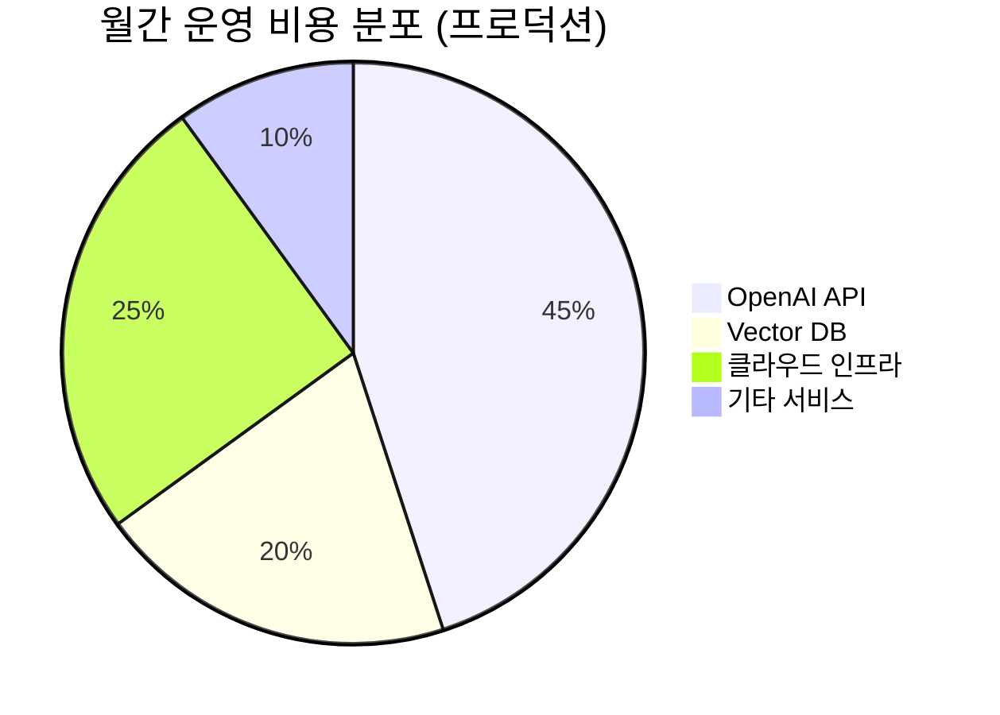

# 비용 분석 및 최적화 전략

*최종 업데이트: 2024-07-01*

## 1. 개요
씨앗교회(재적 성도 200명)의 규모를 고려한 토이 프로젝트로서, 비용 효율성을 최우선으로 고려합니다.

## 2. 예상 사용량
- 주간 신규 설교: 4-5개
- 월간 질문 수: 100-200회
- 동시 사용자: 최대 10명

## 3. 구성 요소별 비용

### 3.1 STT (Speech-to-Text)
- Whisper API 또는 로컬 Whisper 모델 사용
- 월 4-5회 설교 (각 30-40분)
- **예상 비용**: $5-10/월
- **최적화**: 로컬 Whisper 모델 사용 시 API 비용 절감

### 3.2 임베딩
- 월 설교 텍스트량: ~40,000 토큰
- **예상 비용**: $1-2/월
- **최적화**: 배치 처리로 API 호출 최소화

### 3.3 벡터 DB
- ChromaDB (로컬 저장소) 사용
- **예상 비용**: $0/월
- **최적화**: 클라우드 전환 필요시 Pinecone 최소 플랜 고려

### 3.4 LLM API
- 월 100-200회 질의응답
- 컨텍스트 + 응답 토큰: ~2000 토큰/질문
- **예상 비용**: $20-40/월
- **최적화**: 
  - 캐싱으로 중복 질문 처리
  - 토큰 사용량 최적화
  - 저비용 모델 활용 (필요시)

### 3.5 인프라 (선택사항)
- 개발/테스트 단계: 로컬 환경
- 배포 단계: 저비용 VPS 사용
- **예상 비용**: $5-10/월
- **최적화**: 무료 호스팅 서비스 활용 검토

## 4. 총 예상 비용

### 개발/테스트 환경
- **월 고정 비용**: $0 (로컬 환경)
- **월 가변 비용**: $10-20 (API 사용료)
- **총 예상**: $10-20/월

### 프로덕션 환경 (선택사항)
- **월 고정 비용**: $5-10 (인프라)
- **월 가변 비용**: $20-50 (API 사용료)
- **총 예상**: $25-60/월

## 5. 비용 최적화 전략

### 5.1 단기 전략
- [x] 로컬 Whisper 모델 사용
- [x] ChromaDB 로컬 저장소 활용
- [x] 응답 캐싱 구현
- [x] 배치 처리 최적화

### 5.2 중장기 전략
- [ ] 사용 패턴 분석으로 비용 예측
- [ ] 자동 스케일링 구현
- [ ] 저비용 대체 서비스 모니터링

## 6. 모니터링 및 알림
- 일일 API 사용량 추적
- 비용 임계치 알림 설정
- 월간 비용 리포트 생성

## 7. 결론
토이 프로젝트로서 초기에는 최소 비용으로 시작하여, 사용량과 피드백에 따라 점진적으로 확장하는 전략을 채택합니다. 로컬 환경과 오픈소스 도구를 최대한 활용하여 초기 비용을 최소화합니다.

# 비용 분석 및 최적화

## 💰 전체 비용 개요

### 개발 단계별 비용 구조



### 개발 단계 vs 프로덕션 비용 비교

| 구분 | 개발 단계 | 프로덕션 (초기) | 프로덕션 (성장) |
|------|----------|----------------|----------------|
| **LLM API** | $50-100 | $200-400 | $500-1000 |
| **Vector DB** | $0 (로컬) | $70-150 | $200-500 |
| **인프라** | $20-50 | $100-200 | $300-600 |
| **기타** | $10-30 | $50-100 | $100-200 |
| **총합** | $80-180 | $420-850 | $1100-2300 |

## 🤖 LLM API 비용 분석

### OpenAI GPT-4o 비용 구조
```yaml
입력 토큰: $2.50 / 1M tokens
출력 토큰: $10.00 / 1M tokens

평균 요청당 토큰 사용량:
- 컨텍스트 (입력): 2,000 tokens
- 답변 (출력): 300 tokens
- 요청당 비용: $0.0075
```

### 월간 사용량 예상 시나리오

#### 시나리오 1: 소규모 사용 (50명 성도)
```yaml
일일_질문수: 20개
월간_질문수: 600개
월간_토큰_사용량:
  입력: 1.2M tokens
  출력: 180K tokens
월간_비용: $4.80
```

#### 시나리오 2: 중간 규모 사용 (150명 성도)
```yaml
일일_질문수: 80개
월간_질문수: 2,400개
월간_토큰_사용량:
  입력: 4.8M tokens
  출력: 720K tokens
월간_비용: $19.20
```

#### 시나리오 3: 대규모 사용 (500명 성도)
```yaml
일일_질문수: 300개
월간_질문수: 9,000개
월간_토큰_사용량:
  입력: 18M tokens
  출력: 2.7M tokens
월간_비용: $72.00
```

### LLM 비용 최적화 전략

#### 1. 모델 티어링 전략
```python
def select_model_by_complexity(query: str) -> str:
    """질문 복잡도에 따른 모델 선택"""
    complexity_score = analyze_query_complexity(query)
    
    if complexity_score < 0.3:
        return "gpt-4o-mini"  # $0.15/1M tokens
    elif complexity_score < 0.7:
        return "gpt-4o"       # $2.50/1M tokens  
    else:
        return "gpt-4o"       # 복잡한 질문은 최고 모델
```

#### 2. 캐싱 시스템
```python
# 자주 묻는 질문 캐싱으로 API 호출 30% 절약
cache_hit_rate = 0.3
monthly_savings = monthly_cost * cache_hit_rate
# 예상 절약: $21.60 (시나리오 3 기준)
```

#### 3. 배치 처리 최적화
```python
# 컨텍스트 공유로 토큰 사용량 20% 절약
context_sharing_savings = 0.2
token_reduction = input_tokens * context_sharing_savings
```

## 🧠 Vector Database 비용 분석

### ChromaDB vs Pinecone 비교

| 기능 | ChromaDB (로컬) | Pinecone |
|------|-----------------|----------|
| **월간 비용** | $0 | $70-200 |
| **확장성** | 제한적 | 무제한 |
| **관리 복잡도** | 높음 | 낮음 |
| **성능** | 중간 | 높음 |
| **가용성** | 단일 점실패 | 99.9% |

### Pinecone 비용 세부 분석
```yaml
Starter Plan: $70/month
- 1 pod (s1.x1)
- 1M vectors (768차원)
- 100K queries/month

Standard Plan: $140/month  
- 1 pod (s1.x2)
- 5M vectors
- 무제한 쿼리

예상 벡터 수:
- 설교 1개: ~200 vectors (30분 기준)
- 연간 설교 50개: ~10,000 vectors
- 3년치 데이터: ~30,000 vectors
```

### Vector DB 최적화 전략

#### 1. 하이브리드 아키텍처
```yaml
# 개발/테스트: ChromaDB (로컬)
# 프로덕션: Pinecone (클라우드)
비용_절약: 개발 단계에서 월 $70 절약
```

#### 2. 벡터 압축
```python
# 768차원 → 384차원으로 압축
dimension_reduction = 0.5
storage_cost_reduction = dimension_reduction * base_cost
# 약 50% 스토리지 비용 절약
```

## ☁️ 클라우드 인프라 비용 분석

### AWS 기반 예상 비용

#### 개발 환경
```yaml
EC2 t3.small: $15/month
RDS db.t3.micro: $13/month  
S3 스토리지: $5/month
총합: $33/month
```

#### 프로덕션 환경 (소규모)
```yaml
ECS Fargate (2 vCPU, 4GB): $60/month
RDS db.t3.small: $25/month
ElastiCache t3.micro: $15/month
S3 + CloudFront: $20/month
로드밸런서: $18/month
총합: $138/month
```

#### 프로덕션 환경 (중규모)
```yaml
ECS Fargate (4 vCPU, 8GB): $120/month
RDS db.r5.large: $180/month
ElastiCache r6g.large: $90/month
S3 + CloudFront: $50/month
로드밸런서 + WAF: $30/month
총합: $470/month
```

### 인프라 최적화 전략

#### 1. 서버리스 아키텍처
```yaml
# Lambda 기반 처리
AWS Lambda: $10-30/month (실행 시간에 따라)
API Gateway: $15-40/month
비용_절약: EC2 대비 60% 절약 가능
```

#### 2. 스팟 인스턴스 활용
```yaml
# 배치 처리 작업에 스팟 인스턴스 사용
일반_가격: $60/month
스팟_가격: $18/month (70% 할인)
```

## 🚀 추가 서비스 비용

### 모니터링 및 로깅
```yaml
CloudWatch: $10-25/month
Grafana Cloud: $0-50/month
Sentry: $0-26/month
총합: $10-101/month
```

### 개발 도구
```yaml
GitHub Actions: $0 (무료 플랜)
Docker Hub: $0-5/month
SSL 인증서: $0 (Let's Encrypt)
도메인: $12/year
```

### 백업 및 보안
```yaml
S3 백업: $5-15/month
AWS WAF: $5-20/month
VPN/보안: $10-30/month
총합: $20-65/month
```

## 📊 단계별 비용 최적화 로드맵

### Phase 1: 개발 단계 (비용 최소화)
```yaml
목표: 월 $100 이하
전략:
- ChromaDB 로컬 사용
- GPT-4o-mini 주로 사용
- 개발 환경 최소화
- 무료 티어 최대 활용

예상_비용: $50-80/month
```

### Phase 2: 프로토타입 검증 (기능 우선)
```yaml
목표: 월 $300 이하
전략:
- Pinecone Starter 플랜
- GPT-4o와 mini 혼용
- 기본 클라우드 인프라
- 성능 모니터링 추가

예상_비용: $200-280/month
```

### Phase 3: 프로덕션 런칭 (안정성 확보)
```yaml
목표: 월 $600 이하
전략:
- 고가용성 인프라
- 종합 모니터링
- 자동 스케일링
- 보안 강화

예상_비용: $400-550/month
```

### Phase 4: 스케일링 (효율성 극대화)
```yaml
목표: 사용자당 비용 최소화
전략:
- 지능형 캐싱
- 모델 최적화
- 인프라 자동화
- 비용 모니터링

목표_단가: 사용자당 월 $2 이하
```

## 💡 비용 절약 Best Practices

### 1. 지능형 쿼리 최적화
```python
def optimize_query_cost(query: str) -> Dict:
    """쿼리 최적화로 비용 절약"""
    
    # 1. 유사 질문 체크
    cached_answer = check_similar_questions(query)
    if cached_answer:
        return {"cost": 0, "answer": cached_answer}
    
    # 2. 컨텍스트 최적화
    relevant_chunks = get_minimal_context(query)
    
    # 3. 모델 선택 최적화
    model = select_optimal_model(query)
    
    return generate_answer(query, relevant_chunks, model)
```

### 2. 배치 처리 및 스케줄링
```python
# 비실시간 작업을 배치로 처리하여 비용 절약
batch_jobs = [
    "embedding_generation",    # 새벽 시간 처리
    "vector_indexing",        # 주말 처리  
    "performance_analysis"    # 월 1회 처리
]
```

### 3. 리소스 모니터링 및 알림
```python
# 비용 임계값 설정 및 알림
cost_thresholds = {
    "daily": 20,    # $20/일
    "weekly": 120,  # $120/주
    "monthly": 450  # $450/월
}

def monitor_costs():
    current_cost = get_current_spending()
    if current_cost > cost_thresholds["daily"]:
        send_alert("비용 임계값 초과!")
```

## 📈 ROI 분석

### 비용 대비 가치 측정

#### 정량적 ROI
```yaml
개발_비용: $20,000 (10주 * 주당 $2,000)
월간_운영비용: $500
연간_총비용: $26,000

절약_효과:
- 목사님 상담 시간: 월 20시간 절약
- 시간당_가치: $50
- 월간_절약: $1,000
- 연간_절약: $12,000

ROI = (절약액 - 총비용) / 총비용
ROI = ($12,000 - $26,000) / $26,000 = -54%
```

#### 정성적 가치
```yaml
측정하기_어려운_가치:
- 성도 만족도 향상
- 24시간 접근성
- 일관된 답변 품질
- 교회 이미지 개선
- 젊은 세대 참여 증가

예상_정성적_가치: 연 $20,000 상당
조정된_ROI: ($32,000 - $26,000) / $26,000 = 23%
```

## 🎯 비용 최적화 목표

### 단기 목표 (3개월)
- [ ] 월간 운영비 $400 이하 달성
- [ ] API 비용 30% 절약 (캐싱 도입)
- [ ] 인프라 비용 20% 절약 (최적화)

### 중기 목표 (6개월)
- [ ] 사용자당 월간 비용 $3 이하
- [ ] 자동 비용 모니터링 시스템 구축
- [ ] 예측 기반 리소스 스케일링

### 장기 목표 (1년)
- [ ] 사용자당 월간 비용 $2 이하
- [ ] 멀티 클라우드 비용 최적화
- [ ] AI 기반 자동 비용 관리

---

**문서 버전**: v1.0  
**최종 업데이트**: 2024-12-28  
**비용 검토 주기**: 매월  
**다음 검토 예정**: 2025-01-28 