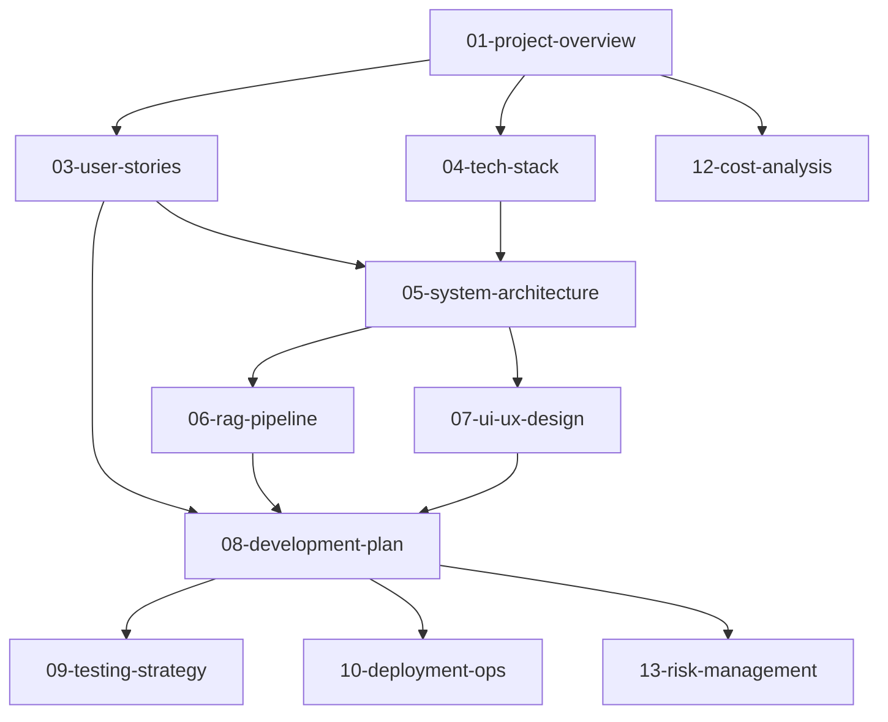

# 씨앗AI - AI 설교 Q&A 서비스 문서

이 디렉토리는 씨앗교회 AI 설교 질문답변 서비스의 모든 기획 및 기술 문서를 포함합니다.

## 📁 문서 구조

| 번호 | 문서명 | 설명 | 상태 |
|------|--------|------|------|
| 01 | [프로젝트 개요](01-project-overview.md) | 비전, 목표, 문제 정의 | ✅ 완료 |
| 02 | [시장 분석 및 경쟁사 조사](02-market-analysis.md) | 시장 현황, 경쟁사 분석 | 📁 파일 생성 |
| 03 | [사용자 스토리 및 시나리오](03-user-stories.md) | 페르소나, 사용자 여정 | ✅ 완료 |
| 04 | [기술 스택](04-tech-stack.md) | 선택된 기술과 근거 | ✅ 완료 |
| 05 | [시스템 아키텍처](05-system-architecture.md) | 전체 시스템 설계 | 📁 파일 생성 |
| 06 | [RAG 파이프라인](06-rag-pipeline.md) | RAG 상세 설계 | ✅ 완료 |
| 07 | [UI/UX 설계](07-ui-ux-design.md) | 화면 설계, 사용자 경험 | 📁 파일 생성 |
| 08 | [개발 계획](08-development-plan.md) | 로드맵, 마일스톤 | ✅ 완료 |
| 09 | [테스트 전략](09-testing-strategy.md) | 테스트 계획, QA 전략 | 📁 파일 생성 |
| 10 | [배포 및 운영](10-deployment-ops.md) | 인프라, DevOps, 모니터링 | 📁 파일 생성 |
| 11 | [보안 및 개인정보보호](11-security-privacy.md) | 보안 요구사항, 컴플라이언스 | 📁 파일 생성 |
| 12 | [비용 분석](12-cost-analysis.md) | 예산, ROI, 비용 최적화 | ✅ 완료 |
| 13 | [위험 관리](13-risk-management.md) | 리스크 분석, 대응 계획 | 📁 파일 생성 |

## 📚 문서 카테고리

### 🎯 전략 및 기획
- **01 프로젝트 개요**: 전체 비전과 목표 설정
- **02 시장 분석**: 타겟 시장과 경쟁사 분석
- **03 사용자 스토리**: 실제 사용자 관점의 요구사항

### 🛠️ 기술 설계
- **04 기술 스택**: 사용할 기술들과 선정 이유
- **05 시스템 아키텍처**: 전체 시스템 구조 설계
- **06 RAG 파이프라인**: 핵심 AI 기능 상세 설계
- **07 UI/UX 설계**: 사용자 인터페이스 설계

### 🚀 개발 및 운영
- **08 개발 계획**: 10주 개발 로드맵
- **09 테스트 전략**: 품질 보증 전략
- **10 배포 및 운영**: 인프라와 운영 계획
- **11 보안 및 개인정보보호**: 보안 요구사항

### 📊 관리 및 평가
- **12 비용 분석**: 예산 계획과 ROI 분석
- **13 위험 관리**: 프로젝트 리스크와 대응 방안

## 🔄 문서 활용 가이드

### 📖 읽기 순서 추천
1. **시작**: 01 → 03 → 08 (프로젝트 이해)
2. **기술**: 04 → 06 → 05 (기술 이해)
3. **실행**: 09 → 10 → 12 (실행 계획)

### ✏️ 문서 업데이트 원칙
- 개발 진행에 따라 지속적 업데이트
- 각 문서 하단에 버전 정보 기록
- 변경사항은 git commit으로 추적

### 🔗 연관 관계

## 📋 체크리스트

### Phase 1: 기획 완료 ✅
- [x] 프로젝트 개요 작성
- [x] 사용자 스토리 작성  
- [x] 기술 스택 선정
- [x] RAG 파이프라인 설계
- [x] 개발 계획 수립
- [x] 비용 분석 완료

### Phase 2: 상세 설계 🔄
- [ ] 시장 분석 작성
- [ ] 시스템 아키텍처 상세화
- [ ] UI/UX 설계 완료
- [ ] 테스트 전략 수립
- [ ] 보안 요구사항 정의

### Phase 3: 운영 준비 📋
- [ ] 배포 계획 수립
- [ ] 위험 관리 계획 완료
- [ ] 모니터링 체계 구축

---

**프로젝트**: 씨앗교회 AI 설교 QA 서비스  
**최종 업데이트**: 2024-12-28  
**다음 검토**: 개발 Phase별 업데이트 